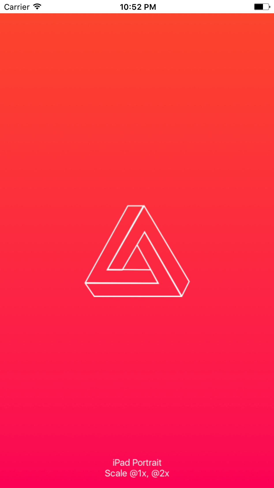
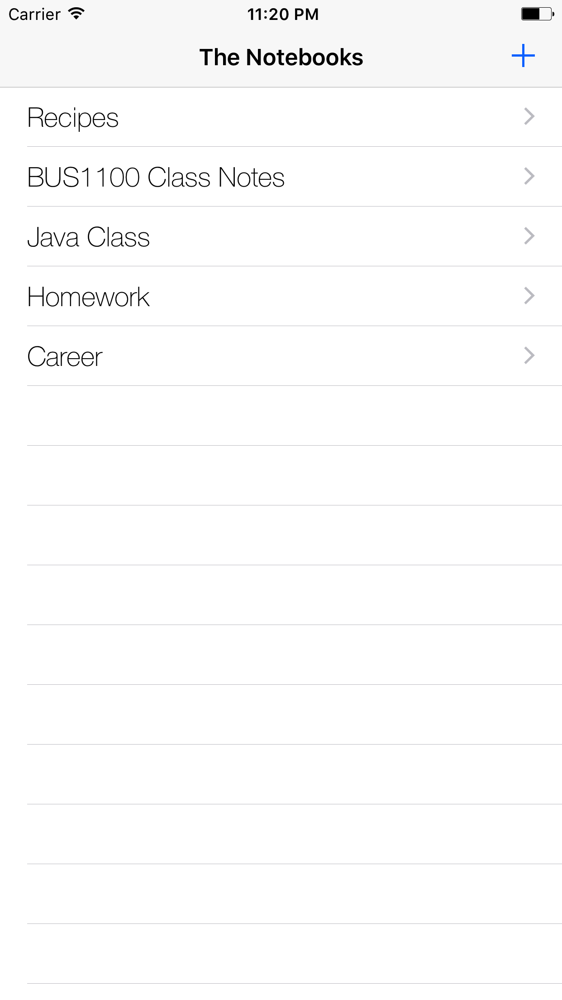
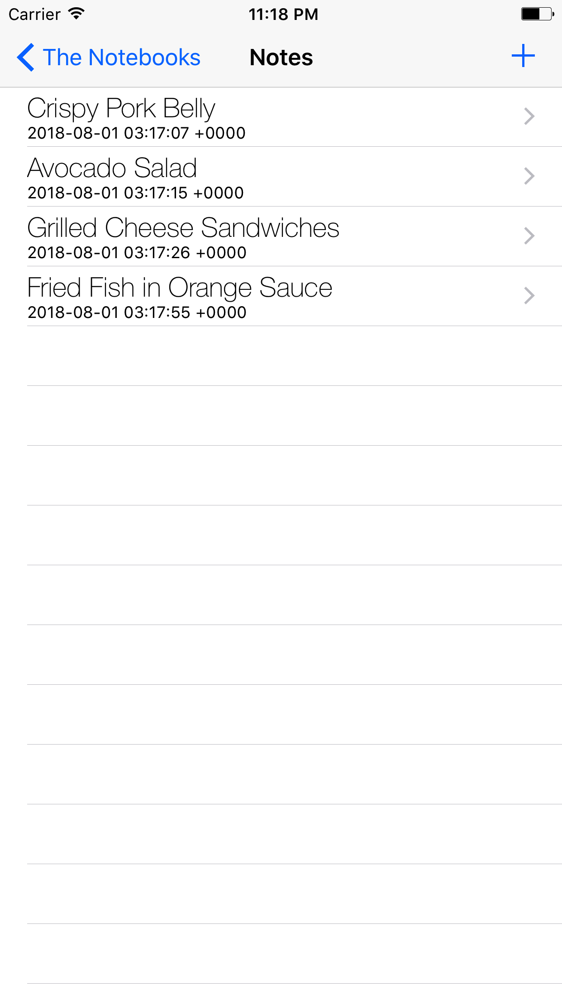
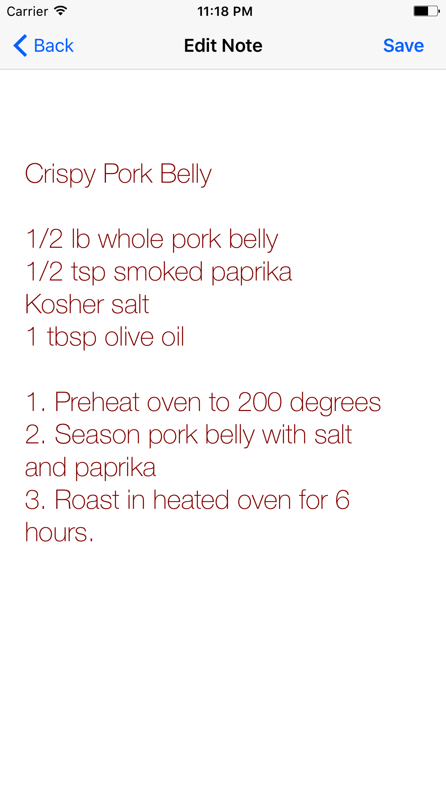
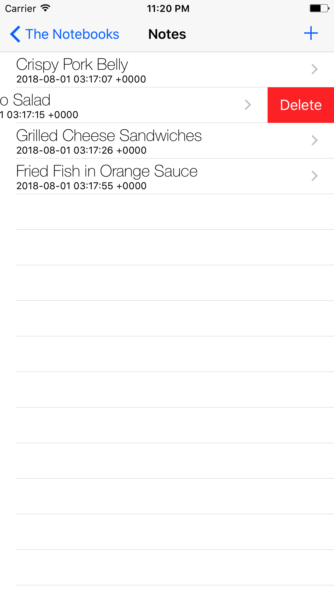

Note Taking App (IOS)	

A simple version of Google Keep. Lets users save, modify, and delete notes. Written in Swift and uses CoreData, TableViews, segues, and multiple view controllers.

Technologies:  Swift 4, Xcode, Core Data.
Description: A note taking app that lets users save, modify, and delete notes. Users can create multiple “notebooks”. 
Used MVC design pattern to design a database in CoreData and model entities as classes/objects
Designed user interface with Navigation Controllers, TableViews, and segues
Notes can be geotagged using current position (lat/long). Geolocation data implemented using MapKit

A simple version of Google Keep. Lets users save, modify, and delete notes. Written in Swift and uses CoreData, TableViews, segues, and multiple view controllers.

Launch Screen

List of "notebooks" (CoreData entity)

Notes for each Notebook (CoreData entity)

Editing and deleting notes using tableview functions

